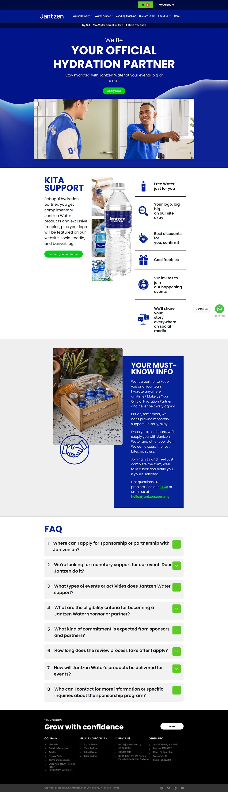

# Partnership Landing Page 💧✨

A modern **Vue 3** landing page project focused on recreating a polished partnership website design with an emphasis on **component reusability**, **responsive layout**, and **clean UI structure**.

Check it out live 👉 **[Partnership Landing Page](https://partnership-page.netlify.app/)**

---

## ✨ Features

- 📱 **Responsive Design** – Built to adapt smoothly across desktop and mobile screen sizes.
- 🧩 **Reusable Vue Components** – Structured with modular components for easier maintenance and scalability.
- 🧭 **Well-Organized Sections** – Includes navigation, hero area, support section, important info, FAQ, and footer.
- ❓ **FAQ Accordion UI** – Expandable FAQ section for clean and user-friendly content presentation.
- 🎨 **Design Recreation Practice** – Focused on translating a static design into a polished front-end experience.
- ⚡ **Fast Development Workflow** – Powered by Vite for fast local development and builds.
- 🌐 **Deployed on Netlify** – Live and accessible online.

---

## 🛠 Tech Stack

- **Vue 3**
- **Vite**
- **Bootstrap 5**
- **Bootstrap Icons**
- **Vue Router**
- **Pinia**

---

## 📸 Screenshot



---

## 🏗 Project Structure

This project was built using reusable and focused Vue components to keep the page easy to manage and extend.

### Main Sections

- **Top Bar / Navigation**
- **Hero Section**
- **Support / Benefits Section**
- **Important Info Section**
- **FAQ Section**
- **Footer**

### Example Reusable Components

- `HeroSection.vue`
- `KitaSupport.vue`
- `ImportantInfo.vue`
- `FaqSection.vue`
- `FaqAccordion.vue`
- `GreenButton.vue`
- `MainNav.vue`
- `FooterBar.vue`

This component-based structure helps keep the layout maintainable and makes it easier to reuse patterns in future landing page projects.

---

## 🚀 Getting Started

Want to run it locally? Follow these steps:

### 📋 Requirements

- **Node.js** (v16 or later recommended)
- **npm**

### ⏳ Installation

1. **Clone the repository**

   ```sh
   git clone https://github.com/YOUR-USERNAME/partnership-page.git
   cd partnership-page
   ```

2. **Install dependencies**

   ```sh
   npm install
   ```

3. **Run the development server**

   ```sh
   npm run dev
   ```

4. Open your browser and go to the local URL shown in the terminal.

---

## 📦 Build for Production

To create an optimized production build:

```sh
npm run build
```

To preview the production build locally:

```sh
npm run preview
```

---

## 🎯 Project Goals

This project was built as a **front-end practice project** to strengthen skills in:

- translating a visual design into a working interface
- building reusable Vue components
- creating responsive layouts
- organizing code for clarity and scalability
- recreating clean marketing-style landing pages

---

## 🎨 Highlights

A few areas of focus while building this project:

- recreating a polished landing page layout with strong visual structure
- breaking the UI into reusable and maintainable components
- keeping styling and spacing consistent across sections
- making the page mobile responsive
- maintaining a simple and organized folder structure

---

## 🌍 Live Demo

🔗 **Live Site:** [https://partnership-page.netlify.app/](https://partnership-page.netlify.app/)

---

## 👨‍💻 About the Author

Created with ❤️ by **[Md Asifullah](https://www.artisanasif.com/)**, a passionate **Front-End Developer & Software Engineer**.

---

## 📜 License

This project is for **learning and portfolio purposes**.

Feel free to explore, fork, and get inspired.

**Happy Coding! 🚀**
